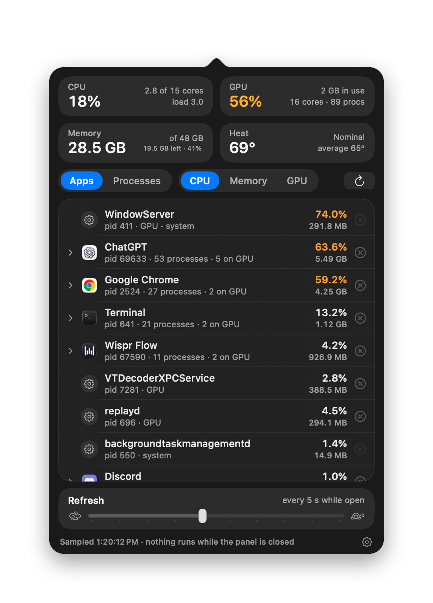

<p align="center">
  
</p>

# HeatWatch

A quick *what is heating up my Mac?* monitor for the menu bar — with the
controls to do something about it.

<p align="center">
  
</p>

## Features

- **One glance** — CPU (and how many cores that is), GPU load and memory, RAM
  used / left, SoC die temperature and the OS thermal state.
- **Real culprits, not helpers** — processes are grouped under the app that
  owns them, so Chrome and its thirty helpers are one row. Expand to look inside.
- **CPU · Memory · GPU** — sort by any of them, per-process GPU % included.
- **Quit or force-kill** a process or a whole app tree, always behind a
  confirmation. System processes are listed but never touched.
- **Zero background cost** — it samples only while the panel is open;
  nothing runs when it is closed.
- **Native look** — Control-Center-style modules in Liquid Glass on macOS 26
  (glass for controls, standard material for the list, as Apple's guidelines
  ask), material boxes on macOS 14/15.
- **Refresh slider** — 1–10 s between samples while the panel is open (default 5); the
  choice is remembered.
- Universal (Apple silicon + Intel), no privacy permissions, no Dock icon,
  optional launch at login.

## Install

Download `HeatWatch-<version>.dmg` from [Releases](../../releases/latest),
drag it to Applications and launch — look for the flame in the menu bar.

macOS 14 or later. The build is signed but not yet notarized, so the first
launch needs System Settings → Privacy & Security → **Open Anyway** (once).

## Build from source

```sh
./build.sh --run        # build/HeatWatch.app, then launch
./build.sh --dist       # dist/HeatWatch-<version>.dmg + .zip
```

Xcode command line tools (Swift 5.10+), no dependencies. How the numbers are
read, the grouping, screenshots and release steps: [docs/INTERNALS.md](docs/INTERNALS.md).

## License

MIT
